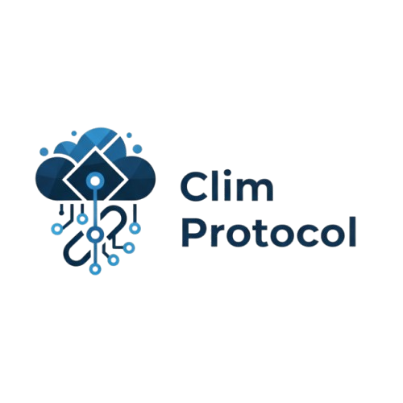

<p align="center">
  
</p>

# Clim Protocol — CRE Settlement Workflow

> **Chainlink Runtime Environment (CRE)** workflow that automates the full settlement lifecycle for parametric climate insurance events on Ethereum Sepolia.

[](LICENSE)
[](https://docs.chain.link/cre)
[](https://bun.sh)

---

## Overview

This CRE workflow replaces the traditional Chainlink Automation + Functions pipeline with a single, composable workflow that runs on Chainlink's Decentralized Oracle Network (DON).

### What It Does

```
┌──────────────────────────────────────────────────────────────────┐
│                    CRE Settlement Workflow                        │
├──────────────────────────────────────────────────────────────────┤
│                                                                  │
│  ⏰ Cron Trigger (every 5 min)                                   │
│       │                                                          │
│       ▼                                                          │
│  📖 EVM Read: SettlementEngine.getActiveEvents()                 │
│       │                                                          │
│       ▼                                                          │
│  📖 EVM Read: ClimProtocol.getEventDetails(eventId)              │
│       │  → latitude, longitude, startTime, endTime, threshold    │
│       │                                                          │
│       ▼                                                          │
│  🌐 HTTP Fetch: Open-Meteo Archive API                           │
│       │  → actual precipitation for the event period             │
│       │  → DON consensus via median aggregation                  │
│       │                                                          │
│       ▼                                                          │
│  🧮 Compute: Compare actual vs threshold                         │
│       │  → precipitation < threshold → DROUGHT → payout          │
│       │                                                          │
│       ▼                                                          │
│  📖 EVM Read: SettlementEngine.checkUpkeep()                     │
│       │                                                          │
│       ▼                                                          │
│  ✍️  EVM Write: SettlementEngine.performUpkeep()                  │
│       │  → triggers oracle request + settlement on-chain         │
│                                                                  │
│  ────────────────────────────────────────────────────────        │
│                                                                  │
│  📡 EVM Log Trigger: SettlementCompleted event                   │
│       │  → logs settlement outcome for observability             │
│                                                                  │
└──────────────────────────────────────────────────────────────────┘
```

### CRE Capabilities Used

| Capability | Purpose |
|---|---|
| **Cron Trigger** | Polls every 5 minutes for events needing settlement |
| **EVM Log Trigger** | Reacts to `SettlementCompleted` events on-chain |
| **EVM Read** | Reads active events, event details, and upkeep status |
| **HTTP Fetch** | Fetches precipitation data from Open-Meteo API |
| **DON Consensus** | Median aggregation across oracle nodes for data integrity |
| **EVM Write** | Triggers `performUpkeep()` on SettlementEngine via signed report |

---

## Prerequisites

1. **Bun** runtime: [bun.sh/docs/installation](https://bun.sh/docs/installation)
2. **CRE CLI**: Install via:
   ```bash
   curl -sSL https://cre.chain.link/install.sh | bash
   ```
3. A **funded Sepolia wallet** (only needed for on-chain writes)

---

## Getting Started

### 1. Install dependencies

```bash
bun install --cwd ./my-workflow
```

### 2. Configure `.env`

Edit `.env` at the project root and add your private key (only needed for chain writes during simulation):

```
CRE_ETH_PRIVATE_KEY=your_private_key_here
```

### 3. Configure RPC endpoint

Edit `project.yaml` and set your Sepolia RPC URL:

```yaml
staging-settings:
  rpcs:
    - chain-name: ethereum-testnet-sepolia
      url: https://your-rpc-endpoint-here
```

### 4. Configure contract addresses

Edit `my-workflow/config.json` with your deployed contract addresses:

```json
{
  "schedule": "0 */5 * * * *",
  "openMeteoBaseUrl": "https://archive-api.open-meteo.com/v1/archive",
  "evms": [
    {
      "protocolAddress": "0x901936D63109b8838591211a16856Eb2C197C1e4",
      "settlementAddress": "0x3d4219054030A09c879A65F2861f18E0Fe3768D2",
      "oracleAddress": "0xF137c61543a2656ED66e58418CE3c27d829617a8",
      "factoryAddress": "0x774FCe394C8287818038A62763263DB4736A92Cb",
      "chainSelectorName": "ethereum-testnet-sepolia",
      "gasLimit": "500000"
    }
  ]
}
```

### 5. Simulate the workflow

From the project root (`cre-workflow/`):

```bash
cre workflow simulate my-workflow
```

You'll see trigger options:

```
🚀 Workflow simulation ready. Please select a trigger:
1. cron-trigger@1.0.0 Trigger
2. evm:ChainSelector:16015286601757825753@1.0.0 LogTrigger
```

- Choose **1** for the cron trigger to simulate the full settlement check pipeline.
- Choose **2** for the log trigger to simulate reacting to a `SettlementCompleted` event.

---

## Project Structure

```
cre-workflow/
├── .env                        # Private key for chain writes
├── .gitignore
├── project.yaml                # CRE project settings (RPC endpoints)
├── secrets.yaml                # Secrets placeholder
├── contracts/
│   └── abi/
│       └── index.ts            # TypeScript ABI exports for all contracts
└── my-workflow/
    ├── main.ts                 # Workflow entry point (handlers + logic)
    ├── config.json             # Contract addresses + schedule config
    ├── workflow.yaml           # CRE workflow settings
    ├── package.json            # Dependencies (@chainlink/cre-sdk, viem, zod)
    └── tsconfig.json           # TypeScript config
```

---

## How It Works

### Cron Trigger Flow

1. **Read Active Events** — calls `SettlementEngine.getActiveEvents()` to get all monitored event IDs.

2. **Fetch Event Details** — for each event, calls `ClimProtocol.getEventDetails(eventId)` to get:
   - Geographic coordinates (latitude/longitude × 1e6)
   - Time period (startTime, endTime as Unix timestamps)
   - Precipitation threshold (mm × 1000)
   - Current status (ACTIVE/SETTLED/EXPIRED)

3. **Identify Expired Events** — filters events where `status == ACTIVE` and `currentTime > endTime`.

4. **Fetch Precipitation** — for each expired event, calls the **Open-Meteo Archive API**:
   ```
   GET https://archive-api.open-meteo.com/v1/archive
     ?latitude=-8.05&longitude=-34.87
     &start_date=2025-01-01&end_date=2025-06-01
     &daily=precipitation_sum&timezone=UTC
   ```
   The HTTP response is aggregated across DON nodes using **median consensus**.

5. **Compare vs Threshold** — if `actual_precipitation < threshold`, the event triggers a drought payout.

6. **Trigger Settlement** — if `checkUpkeep()` returns true, calls `performUpkeep()` via a DON-signed report to initiate the on-chain settlement process.

### EVM Log Trigger Flow

Listens for `SettlementCompleted(uint256 eventId, uint256 precipitationMm, bool payoutTriggered)` events emitted by the SettlementEngine. When detected, logs the full settlement outcome for off-chain monitoring and analytics.

---

## Architecture: CRE vs Traditional Approach

| Aspect | Traditional (Automation + Functions) | CRE Workflow |
|---|---|---|
| **Trigger** | Chainlink Automation `checkUpkeep` | CRE Cron Trigger |
| **Data Fetch** | Chainlink Functions JS execution | CRE HTTP Capability |
| **Consensus** | Functions DON consensus | CRE DON median aggregation |
| **Chain Write** | Automation `performUpkeep` | CRE EVM Write (signed report) |
| **Composability** | Separate registrations | Single workflow file |
| **Observability** | On-chain events only | Built-in logging + log triggers |
| **Cost** | LINK for Automation + Functions | Single CRE subscription |

---

## Deployed Contracts (Sepolia)

| Contract | Address |
|---|---|
| ClimateEventToken | `0xBc0f8DF2ad5dC218BbbA579C65F3C274DBbBded6` |
| LiquidityPool | `0x6440239C519d62BF94f37DaE08635BE65Ac8f8B1` |
| ClimateOracle | `0xF137c61543a2656ED66e58418CE3c27d829617a8` |
| SettlementEngine | `0x3d4219054030A09c879A65F2861f18E0Fe3768D2` |
| ClimateEventFactory | `0x774FCe394C8287818038A62763263DB4736A92Cb` |
| ClimProtocol | `0x901936D63109b8838591211a16856Eb2C197C1e4` |

---

## License

MIT — see [LICENSE](../LICENSE) for details.
